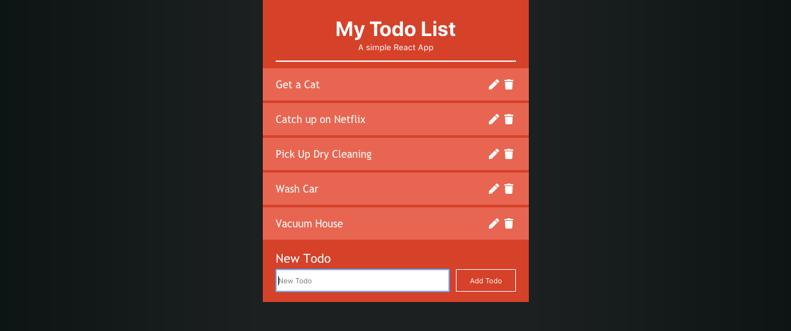
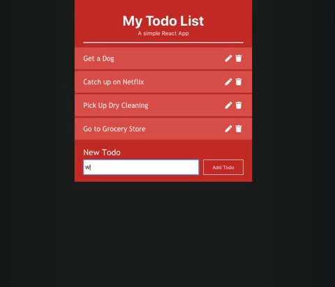

# React Todo List 

### Project Overview
Created a Todo App that allows users to see, add, edit, and remove todos. Each Todo component displays a button with an icon to "edit" it when clicked, it displays a form with the task of the todo as an input and a save icon to submits the form. When the form is submitted, the task of the text is updated and the form is hidden. 

Alongside each Todo, the application is designed so that the todo itself can be clicked to mark it as completed. A strikethrough style to the Todo if it is completed. A user can toggle it on and off by clicking on the text of the todo. A delete icon removes the todo as well. 

Finally this app saves todos in localStorage and retrieves them when the page loads.

## My Finished Project

### What I've Learned

* How to use componentDidUpdate() and componentDidMount() — very useful for saving/loading to and from local storage 
* Storing objects in localStorage you need to use JSON.stringify(data)
* To convert the saved data in localStorage you need to covert it back to the JSON object JSON.parse(data)
* If you are using props in state, you need to have super(props)
* How to map over data to edit specific data in state with a function. 

:thumbsup: *Thanks for checking out my work on GitHub! For more about me find me on Twitter [@TyeDev](https://twitter.com/tyedev) or visit my personal website [TyeCampbell.com](www.TyeCampbell.com).*
